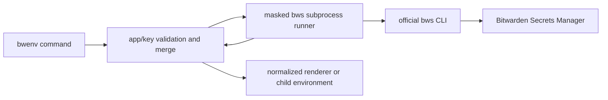

# Architecture

## Purpose and boundary

`bwenv` is not a Bitwarden client implementation. It delegates authentication, state, profiles, server routing, and secret CRUD to the official `bws` executable. Its domain is limited to app-prefix normalization, shared-value merging, dotenv workflows, output presentation, and child-process environments.

## Subsystems

- `cmd` owns Cobra command construction, dependency injection, stdio, and exit-code translation. Help, version, and completion generation do not initialize Bitwarden dependencies.
- `internal/bws` is the only Bitwarden I/O boundary. It constructs official arguments, forces machine-readable JSON for internal operations, masks sensitive verbose output, and preserves subprocess errors.
- `internal/environment` owns `<app>__KEY`, validation, exact resolution, duplicate detection, normalization, stable ordering, and shared/app precedence.
- `internal/output` renders already-normalized entries. It must not perform Bitwarden calls or environment selection.

## Data flow

Read commands list one project in JSON, decode official secret records, select app/shared prefixes, normalize keys, and render. Mutations first list the project to enforce the environment namespace’s uniqueness rules, then call official create/edit/delete operations.

Import parses and validates every key and value in the complete dotenv input before remote work, lists once, builds a full-key index, and applies sorted upserts. It is fail-fast but not transactional because the official CLI exposes independent remote operations.

Run validates its command and shell before fetching secrets, performs the same single-list and merge path, converts entries to a unique environment map, ensures no case variant of the machine access-token variable remains, and starts a shell with inherited stdio. It waits for the child so exit status is portable across macOS, Linux, and Windows.

## Security invariants

- Never write access tokens or fetched values to disk.
- Never include tokens, values, or notes in verbose logs or errors generated by bwenv.
- Never pass any case variant of `BWS_ACCESS_TOKEN` into a command started by `run`, including when a stored secret uses that key.
- Never choose among duplicate full keys; fail with non-secret identifiers.
- Never mutate during a dry run.
- Resolve all requested delete keys before the first delete.
- Treat commands run with secrets as trusted code, not as a sandbox.

The official CLI requires secret values as process arguments for create/edit. This unavoidable local process-list exposure is documented to users.

## Testing strategy

Pure domain and renderer tests cover validation, precedence, duplicates, stable output, and lossless dotenv round trips. Command tests inject a fake Bitwarden client and real in-memory stdio. Runner tests cover argument construction, warning forwarding, masking, and early command validation without contacting Bitwarden. Cross-platform CI tests and builds all supported operating systems; the race detector runs on Linux.
